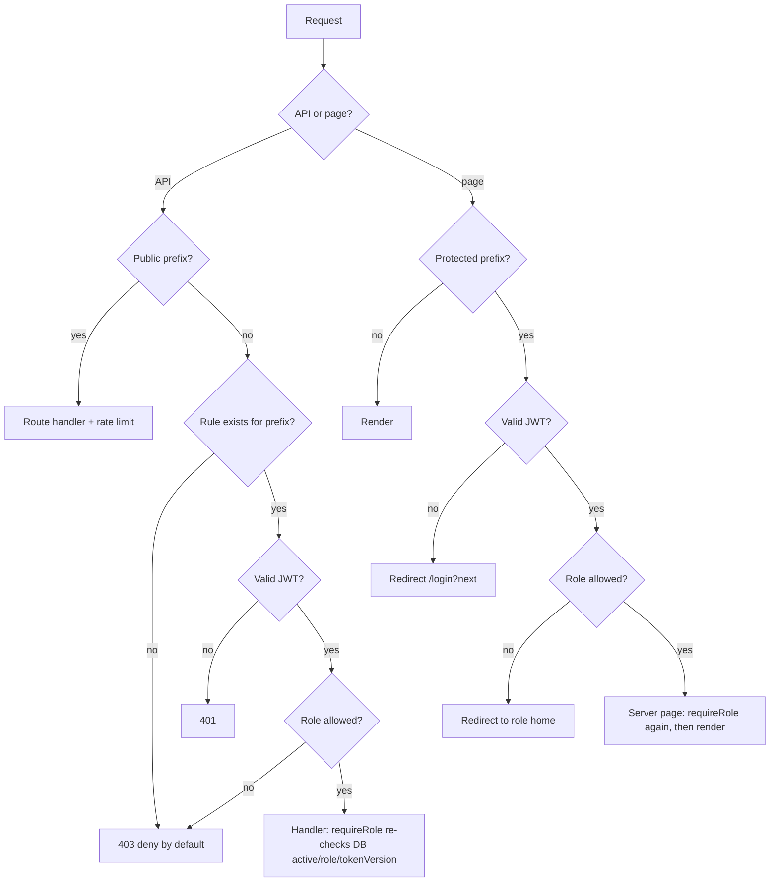
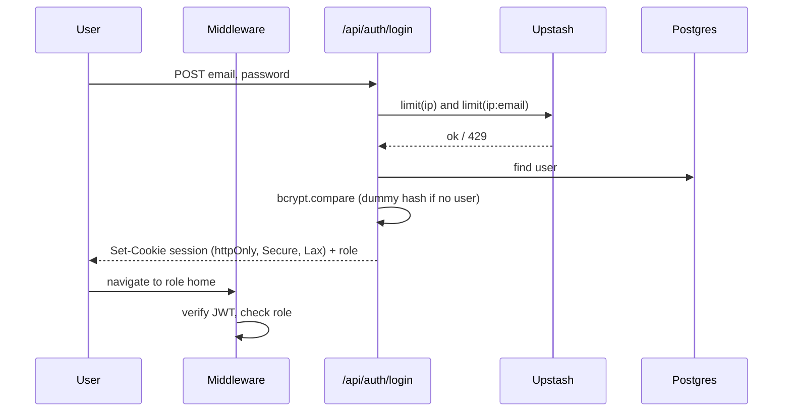
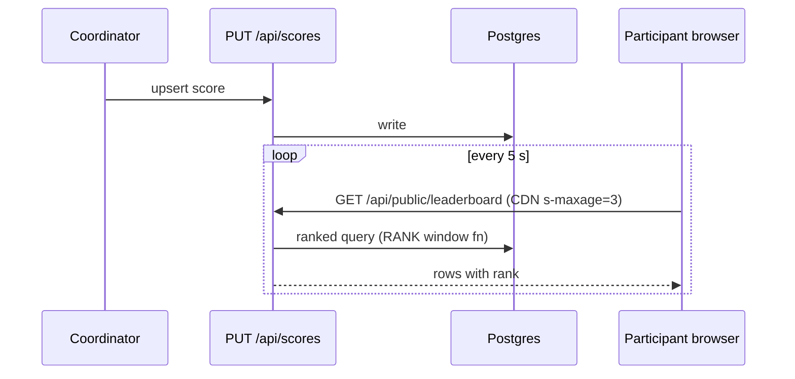

# Application Flow
Route map, role journeys, and request paths. Companion to PRD / TRD.

## 1. Route map
| Route | Access | Purpose |
|---|---|---|
| `/` , `/leaderboard` | public | landing, public results |
| `/login`, `/signup` | public | auth |
| `/register` | Participant | registration form |
| `/participant` | Participant | summary, fees, announcements |
| `/volunteer` | Volunteer+ | assigned duties (read-only) |
| `/coordinator` (+ `/attendance`, `/scores`, `/duties`) | Coordinator, Super Admin | duty & attendance & scores |
| `/super-admin` (+ `/duties`, `/registrations`, `/announcements`, `/competitions`, `/audit`) | Super Admin | full control |

Unauthenticated → `/login?next=…`. Authenticated but wrong role → redirected to own home. Unknown `/api/*` → 403.

## 2. Access decision (every request)

## 3. Authentication flow

Logout clears the cookie; Super Admin "force logout" bumps `tokenVersion`.

## 4. Participant journey

```mermaid
flowchart LR
  S[Sign up / login] --> F[/register/]
  F --> ID[Pick ID file, client checks type and size]
  ID --> T{Transport?}
  T -- Yes --> BP[Boarding point, charge shown]
  T -- No --> AC
  BP --> AC{Accommodation?}
  AC -- Yes --> DT[Days, check-in, check-out]
  AC -- No --> FD
  DT --> FD{Food?}
  FD -- Yes --> ML[Meals per day]
  FD -- No --> SUM
  ML --> SUM[Fee summary]
  SUM --> SUB[Submit]
  SUB --> UP[1. request signed upload, 2. upload to private bucket]
  UP --> API[POST /api/registration: validate, recompute fees, save]
  API --> DASH[/participant: summary, status UNPAID/]
  DASH --> LB[Live leaderboard and announcements]
```

**Registration submit, detail:** form validated (Zod) → `POST /api/uploads/id-proof` (rate-limited; returns server-generated path + token) → browser uploads file directly to storage → `POST /api/registration` with `idProofPath` → server checks path belongs to the user, university and boarding point exist, recomputes fees, inserts (duplicate → 409) → redirect to dashboard.

## 5. Super Admin flows
1. **Assign coordinator:** choose college UID + user → `POST /api/admin/coordinators` → role = COORDINATOR, `universityId` set, `tokenVersion++`, audit row → user's next request uses the new role.
2. **Allocate duty:** choose coordinator, title, venue, slot → `POST /api/admin/duties` (`HIGH_LEVEL`) → appears in Coordinator dashboard.
3. **Review registration:** list → open ID proof → `GET /api/uploads/id-proof?registrationId=` → 60 s signed URL + audit log → set `idProofStatus` and `paymentStatus`.
4. **Publish:** create competition, announcements.

## 6. Coordinator flows
- **Assign volunteer duty:** pick volunteer (same university), fill duty → `TASK` duty created.
- **Attendance:** open duty → for each volunteer tap Present/Absent → `POST /api/coordinator/attendance` → server stores `markedAt = now()`, `markedBy`; history append-only; latest row per volunteer is current status.
- **Scores:** pick competition → add/edit row → `PUT /api/scores/[id]` (upsert on competition + team) → cache revalidated.

## 7. Volunteer flow
Login → `/volunteer` → list of own duties (`WHERE assignedToId = session.sub`) with venue and slot. No mutations.

## 8. Live leaderboard flow

Only `isPublished` competitions are returned publicly.

## 9. Error & edge paths
| Situation | Behaviour |
|---|---|
| Session expired mid-form | 401 → login → return to `/register` (form state kept in memory only if same tab; file must be re-picked) |
| Upload succeeded, registration failed | Orphan object; nightly job deletes files in `id-proofs/` with no matching registration older than 24 h |
| Duplicate registration | 409 "You have already registered" |
| Rate limited | 429 + `Retry-After`, UI shows countdown |
| Role changed while logged in | Next request fails `tokenVersion` check → re-login |
| Coordinator marks same volunteer twice | New log row; UI shows latest, history retained |
